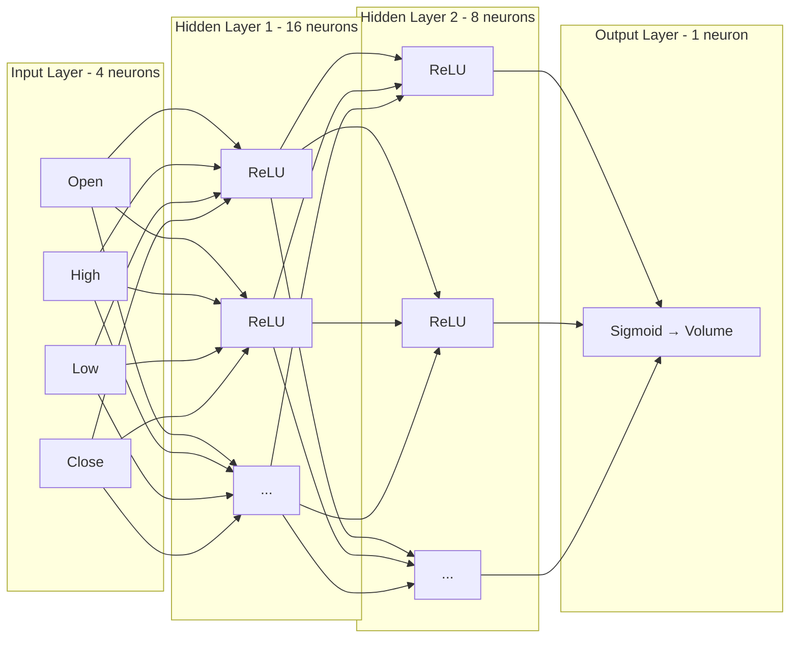

# Rust Neural Network from Scratch

A lightweight, dependency-minimal implementation of a Multi-Layer Perceptron (MLP) in Rust. This project demonstrates the fundamental mathematics of Deep Learning, including vector-based operations, activation functions, and the backpropagation algorithm — trained on real stock market data (Meta/Facebook).

## Features

- **Layer-based architecture** — layers as vectors, weights as flattened matrices for memory locality
- **Multiple activation functions** — Sigmoid, ReLU, Leaky ReLU, Tanh, Identity
- **Mini-batch gradient descent** — gradients accumulated over batches, averaged before update
- **CSV data loading** — generic loader with optional column skipping and header support
- **Min-Max normalization** — inputs and outputs scaled to [0, 1]
- **Train/Test split** — randomized dataset split to evaluate generalization

## Network Architecture

The default configuration uses Meta stock data (Open, High, Low, Close) to predict Volume:

```
Input (4) → Hidden (16, ReLU) → Hidden (8, ReLU) → Output (1, Sigmoid)
```



## How It Works

### Forward Propagation

For every neuron in a layer, we calculate the **Weighted Sum** (s) then pass it through an activation function:

```
s = sum(w_i * x_i) + b
a = activation(s)
```

The `forward` method iterates through each neuron, computes the dot product of weights and inputs, adds the bias, caches the result in `last_sums`, and returns activated outputs for the next layer.

### Backpropagation

The network learns using the **Chain Rule** to compute the gradient of the cost function with respect to every weight and bias.


**Step A — Output Error:** `Error = prediction - target`

**Step B — Local Delta:** `delta = dC/da * f'(s)`

**Step C — Parameter Gradients:**
- Bias gradient: `delta`
- Weight gradient: `delta * input`
- Error relay to previous layer: `sum(delta * w)`

### Mini-Batch Gradient Descent

Gradients are accumulated across all samples in a batch, then averaged before updating weights and biases:

```
w_new = w_old - learning_rate * (accumulated_gradient / batch_size)
```

### Data Pipeline

1. **CSV Loading** — Parses CSV with header skipping and optional first-column skip (for date fields)
2. **Normalization** — Min-Max scaling to [0, 1] for both inputs and outputs
3. **Shuffled Split** — Random 80/20 train/test split to avoid ordering bias

## Sample Output

```
Loaded 3455 samples from meta_stock_data.csv
Training on 2764 samples, Testing on 691 samples...
Epoch 0 | Train MSE: 0.020948
Epoch 100 | Train MSE: 0.001288
...
Epoch 1000 | Train MSE: 0.001263

Final Test MSE: 0.002386

Sample Predictions:
Target: 0.0374 | Predicted: 0.0395
Target: 0.0128 | Predicted: 0.0149
Target: 0.1073 | Predicted: 0.0728
```

## How to Run

1. Ensure you have Rust and Cargo installed.
2. Place a CSV file (e.g. `meta_stock_data.csv`) in the project root.
3. Run:

```bash
cargo run
```

## Dependencies

| Crate | Version | Purpose |
|-------|---------|---------|
| `rand` | 0.8 | Weight initialization & dataset shuffling |
| `csv` | 1.1 | CSV file parsing |

## Key Implementation Notes

- **Weight Initialization:** Random uniform values in [-1, 1]. Never initialize to zero — it prevents symmetry breaking.
- **Biases** start at 0, which is safe since weights already break symmetry.
- **Activation choice matters:** ReLU for hidden layers (fast, avoids vanishing gradients), Sigmoid for output (bounded [0, 1] for normalized targets).
